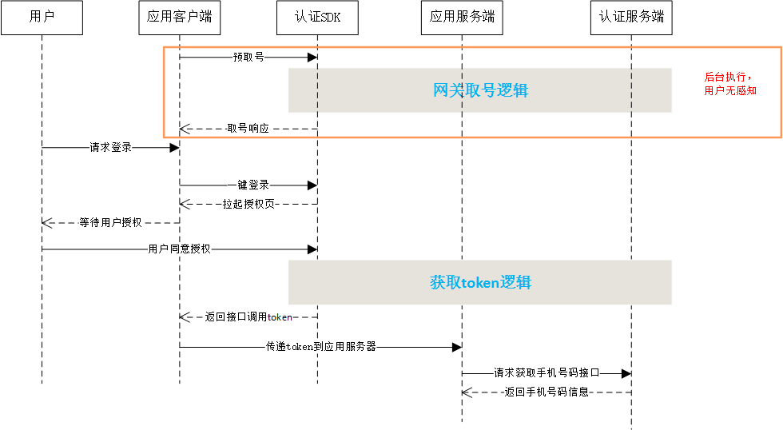
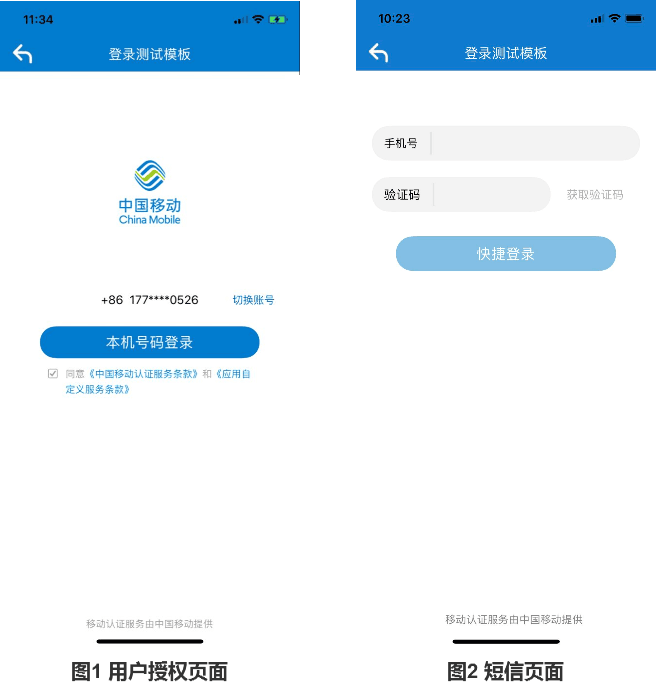
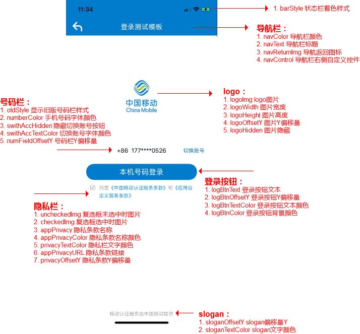
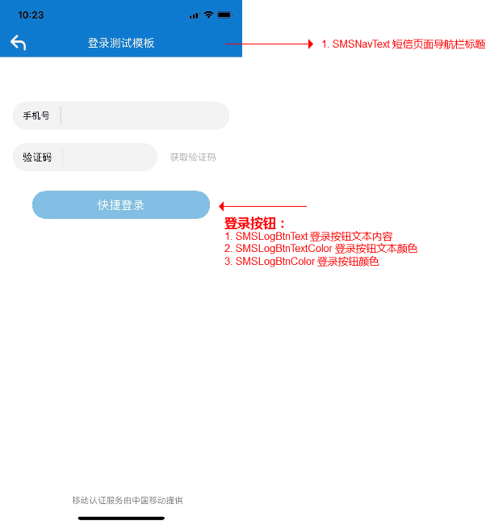
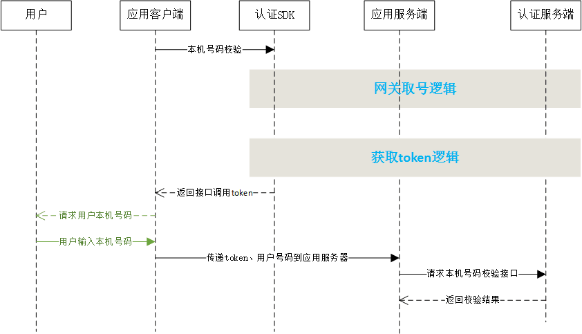

# 1. 接入指南

sdk技术问题沟通QQ群：609994083</br>

**注意事项：**

1. 目前SDK支持中国移动2/3/4G、中国电信4G的取号能力，中国联通的取号能力暂未开放。
2. 由于运营商取号能力是通过数据网关实现，取号过程必须在数据流量打开的情况下才能进行（WiFi和数据流量同时打开时，SDK会强制切换到数据流量执行取号逻辑，将会消耗用户少量流量），当信号弱或者网络有干扰时，时延会高于平均值，取号成功率较低。
3. 本SDK同时提供一键登录和本机号码校验功能，开发者根据实际的需求调用对应方法和接口。

## 1.1. 接入流程

**1.申请appid和appkey**

根据《开发者接入流程文档》，前往中国移动开发者社区（dev.10086.cn)，按照文档要求创建开发者账号并申请appid和appkey，并填写应用的包名.（bundle ID)

**2.申请能力**

应用创建完成后，在能力配置页面上，勾选应用需要接入的能力类型，如一键登录，并配置应用的服务器出口IP地址。（如果在服务端需要用非对称加密方法对一些重要信息进行加密处理，请在能力配置页面填写RSA加密的公钥）

## 1.2. 开发流程

**第一步：下载SDK及相关文档**

请在开发者群或官网下载最新的SDK包

**第二步：搭建开发环境**

1. xcode版本需使用9.0以上，否则会报错
2. 导入认证SDK的framework，直接将移动认证`TYRZSDK.framework`拖到项目中
3. 在Xcode中找到`TARGETS-->Build Setting-->Linking-->Other Linker Flags`在这选项中需要添加`-ObjC`

**第三步：开始使用移动认证SDK**

**[1] 初始化SDK**

在appDelegate.m文件的`didFinish`函数中添加初始化代码。初始化代码只需要执行一次就可以。

```objective-c
- (BOOL)application:(UIApplication *)application didFinishLaunchingWithOptions:(NSDictionary *)launchOptions {

     [TYRZSDK registerAppId:APPID appKey:APPKEY];
    return YES;
}
```

**方法原型：**

```objective-c
+ (void)registerAppId:(NSString *)appId appKey:(NSString *)appKey;
```

**参数说明：**

| 参数   | 类型     | 说明        |
| ------ | -------- | ----------- |
| appID  | NSString | 应用的appid |
| appKey | NSString | 应用密钥    |

<div STYLE="page-break-after: always;"></div>

# 2. 一键登录功能

## 2.1. 准备工作

在接入一键登录功能之前，开发者必须先按照1.1接入流程，在中国移动开发者社区注册开发者账号，创建一个包含移动认证能力的应用，获取响应的AppId和AppKey，并且在开发者社区中勾选一键登录能力，配置应用服务器出口ip地址。

## 2.2. 流程说明

移动认证一键登录允许开发者在用户同意授权后，在客户端侧获取`接口调用凭证`（token），第三方服务器携带token调用`获取手机号码接口`，实现获取当前授权登录用户的手机号码等信息。

根据开发者是否提前调用预取号，可以用2种调用逻辑：

提前预取号时：

1. 开发者调用预取号方法，预取号成功将会返回当前用户取号状态是否成功。
2. 开发者调用一键登录方法，SDK将拉起授权页；
3. 用户同意应用获取本机号码，成功时，SDK将返回接口调用凭证token；
4. 携带token进行接口调用，获取用户的手机号码信息。

整体流程：



未提前预取号时：

1. 开发者调用显式登录方法，等待取号结果，如果取号成功，SDK将拉起授权页；
2. 用户同意应用获取本机号码，成功时，SDK将返回接口调用凭证token；
3. 携带token进行接口调用，获取用户的手机号码信息。

整体流程：


## 2.3. 预取号（非必选）

由于移动认证网关取号受用户当前的使用网络状态影响，对于未开启数据网络、弱信号等终端，一键登录网关取号很有可能会失败，因此，移动认证提供预取号方法，在使用一键登录之前，在用户无感知的情况下，调用本方法，提前预知用户当前网络状态是否可实现一键登录，并暂时缓存一个临时取号凭证在应用的运行内存中，保证开发者在使用一键登录时，不需要再次执行耗时更长的网关取号流程。

预取号时，需要注意以下几点：

1. 临时取号凭证保存在内存中，应用被杀死后，凭证也会一起消失。凭证消失后，开发者可以再次调用预取号方法刷新当前用户的网络状态，根据预取号结果，再决定是否调用一键登录方法。
2. 凭证如果未因为应用被杀死而消失，其有效期为60分钟。
3. 建议对未登录的用户，在应用开启时或者在用户登录操作前的页面，调用预取号方法。
4. 预取号是非必选调用，开发者可以直接跳过2.3，直接调用2.4的一键登录方法，在一键登录方法中将会实现预取号的逻辑。（取号过程会有时延，用户能感知）
5. 支持开发者自定义预取号超时时间。

**请求示例代码**

```objective-c
[TYRZUILogin preGetPhonenumberWithTimeout:8000 
 						       completion:^(id sender) {
        NSString *resultCode = sender[@"resultCode"];
        NSMutableDictionary *result = [NSMutableDictionary dictionaryWithDictionary:sender];
        if ([resultCode isEqualToString:CLIENTSUCCESSCODECLIENT]) {
            NSLog(@"预取号成功");
        } else {
            NSLog(@"预取号失败");
        }
        [self showInfo:result];
    }];
```

**预取号方法原型**

```objective-c
+ (void)preGetPhonenumberWithTimeout:(NSTimeInterval)timeout 
    					  completion:(void(^)(id sender))complete;
```

**参数说明：**

| 参数     | 类型           | 说明                                         |
| -------- | -------------- | -------------------------------------------- |
| timeout  | NSTimeInterval | 自定义取号超时时间（默认8000毫秒），单位：ms |
| complete | Block          | 取号回调                                     |

**返回说明：**

| 参数       | 类型     | 说明             |
| ---------- | -------- | ---------------- |
| resultCode | NSString | 返回相应的结果码 |
| desc       | NSString | 调用描述         |

## 2.4. 一键登录

开发者在用户需要使用到一键登录的场景，调用一键登录方法，SDK将会拉起用户授权页面，用户授权后，SDK将返回取号调用token给应用客户端。

**一键登录逻辑说明**

用户点击登录操作时，开发者调用一键登录方法，若开发者提前预取号成功并且凭证存在且有效，SDK将瞬间拉起用户授权页面（图1），用户授权登录后，SDK将返回token给应用客户端。

如果开发者没有提前调用预取号方法或凭证失效，取号将会有一个时延（用户等待的交互由开发者完成），取号成功时，将拉起用户授权页面（图1），取号失败时，将跳转到验证码登录页面（图2）（开发者可以使用自己的短信验证码登录方式，参考4.7章）




**请求示例代码**

```objective-c
[TYRZUILogin getTokenExpWithController:self 
 						       timeout:8000 
 							  complete:^(id sender) {
        						
                              //SDK响应时，客户端执行的逻辑
                                ……………… 
                                ………………
                              //可参考demo示例代码                   
    }
];

```

**一键登录方法原型**

```objective-c
+ (void)getTokenExpWithController:(UIViewController *)vc
                          timeout:(NSTimeInterval)timeout
                         complete:(void (^)(id sender))complete;
```

**参数说明：**

| 参数     | 类型             | 说明                                         |
| -------- | ---------------- | -------------------------------------------- |
| vc       | UIViewController | 开发者调用一键登录方法时所在的页面控制器     |
| timeout  | NSTimeInterval   | 自定义取号超时时间（默认8000毫秒），单位：ms |
| complete | Block            | 取号回调                                     |

**返回说明：**

| 参数       | 类型     | 说明                                                         |
| ---------- | -------- | ------------------------------------------------------------ |
| resultCode | NSString | 返回相应的结果码                                             |
| openId     | NSString | 成功时返回：用户身份唯一标识                                 |
| token      | NSString | 成功时返回：临时凭证，token有效期2min，一次有效，同一用户（手机号）10分钟内获取token且未使用的数量不超过30个 |

## 2.5. 授权页面设计

为了确保用户在登录过程中将手机号码信息授权给开发者使用的知情权，一键登录需要开发者提供授权页登录页面供用户授权确认。开发者在调用授权登录方法前，必须弹出授权页，明确告知用户当前操作会将用户的本机号码信息传递给应用。

### 2.5.1. 页面规范细则

**iOS授权页面规范：**



**iOS短验页面规范：**




**注意：开发者不得通过任何技术手段，将授权页面的隐私栏、品牌露出内容隐藏、覆盖，对于接入移动认证SDK并上线的应用，我方会对上线的应用授权页面做审查，如果有出现未按要求设计授权页面，将隐私栏、品牌等UI隐去不可见的设计，我方有权将应用的登录功能下线。**

###2.5.2. 修改授权页布局

开发者通过调用授权页面布局方法customUIWithParams，根据2.5.1所示规则配置授权页面默认元素，并且允许开发者在授权页面上添加自定义的控件和事件。

**授权页面默认元素修改**

创建一个UACustomModel 类，设置好类的属性（属性名可参考UACustomModel.h文件查看或者查看2.5.3查看model属性）,然后将设置好的model实例作为参数传进 customUIWithParams方法里

**开发者自定义控件**

customUIWithParams将把授权页面customAreaView回调给开发者，开发者成功获取该页面后，可以在页面上添加自定义的元素和添加事件。

注意：开发者定义的元素无法覆盖授权页面的默认元素

**方法原型**

```objective-c
+ (void)customUIWithParams:(UACustomModel *)model
               customViews:(void(^)(UIView *customAreaView))customViews;
```

**参数说明**

| 参数        | 类型          | 说明                                      |
| ----------- | ------------- | ----------------------------------------- |
| model       | UACustomModel | 用于配置页面默认元素的类，具体可参考2.5.3 |
| customViews | UIView        | 开发者自定义控件                          |

**布局示例代码**

```objective-c
UACustomModel *model = [[UACustomModel alloc]init];
	model.navReturnImg = [UIImage imageNamed:@"delete.png"];
    model.logoImg = [UIImage imageNamed:@"(friend_quan)_[图片]SFont.CN"];
    model.logoWidth = 100;
    model.logoHeight = 120;
    model.numberColor = [UIColor blackColor];
    model.navText = [[NSAttributedString alloc]initWithString:@"你好" attributes:@{}];
  	...............
	...............
	...............
    [TYRZUILogin customUIWithParams:model 
     					customViews:^(UIView *customAreaView) {
        UIImageView *iamgeView = [[UIImageView alloc]initWithImage:[UIImage imageNamed:@"WechatIMG16.jpeg"]];
//        [customAreaView addSubview:iamgeView];
                        }
    ];

```

### 2.5.3. Model属性

**授权页导航栏属性**

| model属性    | 值类型             | 属性说明             |
| ------------ | ------------------ | -------------------- |
| navColor     | UIColor            | 导航栏颜色           |
| barStyle     | UIBarStyle         | 状态栏着色样式       |
| navText      | NSAttributedString | 导航栏标题           |
| navReturnImg | UIImage            | 导航返回图标         |
| navControl   | UIBarButtonItem    | 导航栏右侧自定义控件 |

**Logo属性**

| model属性   | 值类型  | 属性说明                |
| ----------- | ------- | :---------------------- |
| logoImg     | UIImage | LOGO图片                |
| logoWidth   | CGFloat | 图片宽度                |
| logoHeight  | CGFloat | 图片高度                |
| logoOffsetY | CGFloat | 图片Y偏移量             |
| logoHidden  | BOOL    | 图片隐藏，YES时隐藏logo |

**号码栏属性**

| model属性         | 值类型  | 属性说明                              |
| ----------------- | ------- | ------------------------------------- |
| oldStyle          | BOOL    | 显示旧版号码栏样式，YES时显示旧版样式 |
| numberColor       | UIColor | 手机号码字体颜色                      |
| swithAccHidden    | BOOL    | 隐藏切换账号按钮，YES时隐藏“切换账号” |
| swithAccTextColor | UIColor | “切换账号”字体颜色                    |
| numFieldOffsetY   | CGFloat | 号码栏Y偏移量                         |

**登录按钮属性**

| model属性       | 值类型   | 属性说明         |
| --------------- | -------- | ---------------- |
| logBtnText      | NSString | 登录按钮文本     |
| logBtnOffsetY   | CGFloat  | 登录按钮Y偏移量  |
| logBtnTextColor | UIColor  | 登录按钮文本颜色 |
| logBtnColor     | UIColor  | 登录按钮背景颜色 |

**隐私条款属性**

| model属性        | 值类型   | 属性说明                     |
| ---------------- | -------- | ---------------------------- |
| uncheckedImg     | UIImage  | 复选框未选中时图片           |
| checkedImg       | UIImage  | 复选框选中时图片             |
| appPrivacy       | NSString | 隐私条款名称（含书名号）     |
| appPrivacyColor  | UIColor  | 隐私条款名称颜色（含书名号） |
| privacyTextColor | UIColor  | 隐私栏文字颜色（不包含条款） |
| appPrivacyURL    | NSString | 隐私条款链接                 |
| privacyOffsetY   | CGFloat  | 隐私条款Y偏移量              |

**底部slogan属性**

| model属性       | 值类型  | 属性说明       |
| --------------- | ------- | -------------- |
| sloganOffsetY   | CGFloat | slogan偏移量Y  |
| sloganTextColor | UIColor | slogan文字颜色 |

**短信验证码页面属性**

| model属性          | 值类型             | 属性说明         |
| ------------------ | ------------------ | ---------------- |
| SMSNavText         | NSAttributedString | 短验页面导航标题 |
| SMSLogBtnText      | NSString           | 登录按钮文本内容 |
| SMSLogBtnTextColor | UIColor            | 登录按钮文本颜色 |
| SMSLogBtnColor     | UIColor            | 登录按钮颜色     |

### 2.5.4. 授权页面的关闭

开发者可以自定义关闭授权页面。

**代码示例**

```objective-c
…………
[self dismissViewControllerAnimated:YES completion:nil];
…………
```

## 2.6. 配置短信验证码

SDK提供了基础的短信验证码校验服务，对于中国移动号码，会通过端口下发短信验证码到用户手机；对于联通和电信手机号码，会通过号码池（158开头手机号）将短信验证码下发到用户手机。

开发者通过调用enableCustomSMS方法，配置是否使用SDK提供的短信验证码页面。

**原型**

```objective-c
+ (void)enableCustomSMS:(BOOL)state;
```

**请求参数**

无

**响应参数**

| 参数  | 类型 | 说明                                                         |
| ----- | ---- | ------------------------------------------------------------ |
| state | BOOL | 是否使用开发者自定义短验（YES：使用；NO：不使用），默认值为NO |

当开发者不调用本配置方法或将state=NO时，一键登录失败将跳转到SDK提供的短信验证码页面。

当state=YES时，用户一键登录失败时，SDK返回对应的错误码到客户端，开发者根据客户端接收到的返回码执行后续的逻辑（如跳转到应用自己的短信验证码等）。

另外，当state=YES时，用户可以在授权页面，点击“切换账号”按钮实现跳转到应用自己的短信验证码页面。开发者可以在一键登录方法中实现该跳转功能。

**短信验证码和授权页关系图**


具体实现示例代码如下：

```objective-c
[TYRZUILogin getTokenExpWithController:self timeout:-1 complete:^(id sender) {
       
    NSLog(@"显示登录:%@",sender);
        NSString *resultCode = sender[@"resultCode"];
        self.token = sender[@"token"];
        NSMutableDictionary *result = [sender mutableCopy];
        NSLog(@"result = %@",result);
        if ([resultCode isEqualToString:CLIENTSUCCESSCODECLIENT]) {
            [self dismissViewControllerAnimated:YES completion:nil];
            result[@"result"] = @"获取token成功";
            
            //用户点击了“切换账号”（customSMS为YES才返回）
        }else if ([resultCode isEqualToString:@"200060"]){
            
            UINavigationController *nav = sender[@"NavigationController"];
            UIViewController *vc = [[UIViewController alloc]init];
            
            
            //导航栏push模式，可以跳回授权页面
            [nav pushViewController:vc animated:YES];

            //present模式，无法跳回授权页面
            //[self presentViewController:vc animated:YES completion:nil];
        }
        else {
            [self dismissViewControllerAnimated:YES completion:nil];
            result[@"result"] = @"获取token失败";
        }
            [self showInfo:result];        
    }];

```

## 2.7. 获取手机号码（服务端）

开发者获取token后，需要将token传递到应用服务器，由应用服务器发起获取用户手机号接口的调用。

调用本接口，必须保证：

1. token在有效期内。（2分钟）
2. token还未使用过。
3. 应用服务器出口IP地址在开发者社区中配置正确。
4. 如果使用RSA加密，确保应用的公钥在开发者社区正确填写。

**接口说明：**

请求地址：https://www.cmpassport.com/unisdk/rsapi/loginTokenValidate

协议： HTTPS 

请求方法： POST+json,Content-type设置为application/json

**请求示例代码：**

```
{
    appid = 10000001;
    msgid = 34a5588136d6404784831609cdcdc633;
    sign = 2240b9213b9b8dccfe7f6257a21071cf;
    strictcheck = 0;
    systemtime = 20180529112443243;
    token = STsid00000015275642798949tUyg6KsmyEWKk005bCfuxUmCXeqeFRK;
    version = "2.0";
}

```

**参数说明**

| 参数                | 约束 | 说明                                                         |
| :------------------ | :--: | :----------------------------------------------------------- |
| version             | 必选 | 填2.0                                                        |
| msgid               | 必选 | 标识请求的随机数即可(1-36位)                                 |
| systemtime          | 必选 | 请求消息发送的系统时间，精确到毫秒，共17位，格式：20121227180001165 |
| strictcheck         | 必选 | 暂时填写"0"                                                  |
| appid               | 必选 | 业务在统一认证申请的应用id                                   |
| expandparams        | 可选 | 扩展参数                                                     |
| token               | 必选 | 需要解析的凭证值。                                           |
| sign                | 必选 | 当**encryptionalgorithm≠"RSA"**时，sign = MD5（appid + version + msgid + systemtime + strictcheck + token + appkey)（注：“+”号为合并意思，不包含在被加密的字符串中），输出32位大写字母；</br>当**encryptionalgorithm="RSA"**，业务端RSA私钥签名（appid+token）, 服务端使用业务端提供的公钥验证签名（公钥可以在开发者社区配置）。 |
| encryptionalgorithm | 可选 | 推荐使用。开发者如果需要使用非对称加密算法时，填写“RSA”。（当该值不设置为“RSA”时，执行MD5签名校验） |

**返回说明**

| 参数         | 类型   | 说明                                                         |
| ------------ | ------ | ------------------------------------------------------------ |
| inresponseto | string | 对应的请求消息中的msgid                                      |
| systemtime   | string | 响应消息发送的系统时间，精确到毫秒，共17位，格式：20121227180001165 |
| resultcode   | string | 返回码                                                       |
| msisdn       | string | 表示手机号码，如果加密方式为RSA，应用需要用私钥进行解密      |

<div STYLE="page-break-after: always;"></div>

# 3. 本机号码校验功能

## 3.1. 准备工作

在接入本机号码校验功能之前，开发者必须先按照1.1 接入流程，在中国移动开发者社区注册开发者账号，创建一个包含移动认证能力的应用，获取响应的AppId和AppKey。并且在开发者社区中勾选本机号码校验能力，配置应用服务器出口ip地址。

## 3.2. 流程说明

移动认证本机号码校验用于校验用户当前输入的手机号码是否为本机号码。

整体流程为：

1. 开发者调用预取号方法，预取号成功将会返回当前用户取号状态是否成功。（非必选）
2. 调用本机号码校验方法，获取用于做本机号码校验的接口调用凭证（token）
3. 携带token和手机号码信息进行接口调用，获取手机号码校验结果。

本机号码校验整体流程：




## 3.3. 预取号（非必选）

由于移动认证网关取号受用户当前的使用网络状态影响，对于未开启数据网络、弱信号等终端，本机号码校验网关取号很有可能会失败，因此，移动认证提供预取号方法，在使用本机号码校验之前，在用户无感知的情况下，调用本方法，提前预知用户当前网络状态是否可实现本机号码校验，并暂时缓存一个临时取号凭证在应用的运行内存中，保证开发者在使用本机号码校验时，不需要再次执行耗时更长的网关取号流程。

预取号时，需要注意以下几点：

1. 临时取号凭证保存在内存中，应用被杀死后，凭证也会一起消失。凭证消失后，开发者可以再次调用预取号方法刷新当前用户的网络状态，根据预取号结果，再决定是否调用本机号码校验方法。
2. 凭证如果未因为应用被杀死而消失，其有效期为60分钟。
3. 建议对未登录的用户，在应用开启时或者在用户登录操作前的页面，调用预取号方法。
4. 预取号是非必选调用，开发者可以直接跳过3.3，直接调用3.4的本机号码校验方法，在本机号码校验方法中将会实现预取号的逻辑。（取号过程会有时延，用户能感知）
5. 设置取号超时方法适用于预取号。

**请求示例代码**

```objective-c
[TYRZUILogin preGetPhonenumberWithTimeout:8000 
 						       completion:^(id sender) {
        NSString *resultCode = sender[@"resultCode"];
        NSMutableDictionary *result = [NSMutableDictionary dictionaryWithDictionary:sender];
        if ([resultCode isEqualToString:CLIENTSUCCESSCODECLIENT]) {
            NSLog(@"预取号成功");
        } else {
            NSLog(@"预取号失败");
        }
        [self showInfo:result];
    }];
```

**预取号方法原型**

```objective-c
+ (void)preGetPhonenumberWithTimeout:(NSTimeInterval)timeout 
    					  completion:(void(^)(id sender))complete;
```

**参数说明：**

| 参数     | 类型           | 说明                                         |
| -------- | -------------- | -------------------------------------------- |
| timeout  | NSTimeInterval | 自定义取号超时时间（默认8000毫秒），单位：ms |
| complete | Block          | 取号回调                                     |

**返回说明：**

| 参数       | 类型     | 说明             |
| ---------- | -------- | ---------------- |
| resultCode | NSString | 返回相应的结果码 |
| desc       | NSString | 调用描述         |

## 3.4. 获取号码校验token

开发者可以在应用内部任意页面调用本方法，获取本机号码校验的接口调用凭证（token）

**请求示例代码**

```objective-c
[TYRZUILogin getTokenImpWithTimeout:8000 
 					       Complete:^(id sender) {
        
        NSString *resultCode = sender[@"resultCode"];
        if ([resultCode isEqualToString:SUCCESSCODE]) {
            self.token = sender[@"token"];
        }
        
        [self showInfo:sender];
        
    }];

```

**本机号码校验方法原型**

```objective-c
+ (void)getTokenImpWithTimeout:(NSTimeInterval)timeout
                      complete:(void (^)(id sender))complete;
```

**参数说明：**

| 参数     | 类型           | 说明                                         |
| -------- | -------------- | -------------------------------------------- |
| timeout  | NSTimeInterval | 自定义取号超时时间（默认8000毫秒），单位：ms |
| complete | Block          | 取号回调                                     |

**返回说明：**

| 参数       | 类型     | 说明             |
| ---------- | -------- | ---------------- |
| resultCode | NSString | 返回相应的结果码 |
| desc       | NSString | 调用描述         |

## 3.5. 本机号码校验（服务端）

开发者获取token后，需要将token传递到应用服务器，由应用服务器发起本机号码校验接口的调用。

调用本接口，必须保证：

1. token在有效期内（2分钟）。
2. token还未使用过。
3. 应用服务器出口IP地址在开发者社区中配置正确。

对于本机号码校验，需要注意：

1. 本产品属于收费业务，开发者未签订服务合同前，每天总调用次数有限，详情可咨询商务。
2. 签订合同后，将不在提供每天免费的测试次数。

**接口说明：**

请求地址： https://www.cmpassport.com/openapi/rs/tokenValidate

协议： HTTPS

请求方法： POST+json,Content-type设置为application/json

**请求示例代码：**

```
{
    body =     {
        openType = 1;
        phoneNum =0A2050AC434A32DE684745C829B3DE570590683FAA1C9374016EF60390E6CE76;
        requesterType = 0;
        sign = 87FCAC97BCF4B0B0D741FE1A85E4DF9603FD301CB3D7100BFB5763CCF61A1488;
        token = STsid0000001517194515125yghlPllAetv4YXx0v6vW2grV1v0votvD;
    };
    header =     {
        appId = 3000******76;
        msgId = f11585580266414fbde9f755451fb7a7;
        timestamp = 20180129105523519;
        version = "1.0";
    };
}
```

**参数说明：**

| 参数          | 层级  | 约束                         | 说明                                                         |
| ------------- | ----- | ---------------------------- | ------------------------------------------------------------ |
| **header**    | **1** | 必选                         |                                                              |
| version       | 2     | 必选                         | 版本号,初始版本号1.0,有升级后续调整                          |
| msgId         | 2     | 必选                         | 使用UUID标识请求的唯一性                                     |
| timestamp     | 2     | 必选                         | 请求消息发送的系统时间，精确到毫秒，共17位，格式：20121227180001165 |
| appId         | 2     | 必选                         | 应用ID                                                       |
| **body**      | **1** | 必选                         |                                                              |
| openType      | 2     | 否，requestertype字段为0时是 | 运营商类型：</br>1:移动;</br>2:联通;</br>3:电信;</br>0:未知  |
| requesterType | 2     | 是                           | 请求方类型：</br>0:APP；</br>1:WAP                           |
| message       | 2     | 否                           | 接入方预留参数，该参数会透传给通知接口，此参数需urlencode编码 |
| expandParams  | 2     | 否                           | 扩展参数格式：param1=value1\|param2=value2  方式传递，参数以竖线 \| 间隔方式传递，此参数需urlencode编码。 |
| phoneNum      | 2     | 是                           | 待校验的手机号码的64位sha256值，字母大写。（手机号码 + appKey + timestamp， “+”号为合并意思）（注：建议开发者对用户输入的手机号码的格式进行校验，增加校验通过的概率） |
| token         | 2     | 是                           | 身份标识，字符串形式的token                                  |
| sign          | 2     | 是                           | 签名，HMACSHA256( appId +     msgId + phonNum + timestamp + token + version)，输出64位大写字母 （注：“+”号为合并意思，不包含在被加密的字符串中,appkey为秘钥, 参数名做自然排序（Java是用TreeMap进行的自然排序）） |

**返回说明：**

| 参数         | 层级  | 类型   | 说明                                                         |
| ------------ | ----- | :----- | :----------------------------------------------------------- |
| **header**   | **1** |        |                                                              |
| msgId        | 2     | string | 对应的请求消息中的msgid                                      |
| timestamp    | 2     | string | 响应消息发送的系统时间，精确到毫秒，共17位，格式：20121227180001165 |
| appId        | 2     | string | 应用ID                                                       |
| resultCode   | 2     | string | 平台返回码                                                   |
| **body**     | **1** |        |                                                              |
| resultDesc   | 2     | String | 平台返回码                                                   |
| message      | 2     | String | 接入方预留参数，该参数会透传给通知接口，此参数需urlencode编码 |
| expandParams | 2     | String | 扩展参数格式：param1=value1\|param2=value2  方式传递，参数以竖线 \| 间隔方式传递，此参数需urlencode编码。 |

<div STYLE="page-break-after: always;"></div>


#4. SDK方法说明

## 4.1. 初始化

用于初始化appId、appKey设置。

**原型**

```objective-c
+ (void)registerAppId:(NSString *)appId appKey:(NSString *)appKey;
```
**请求参数**


| 参数   | 类型     | 说明        |
| ------ | -------- | ----------- |
| appID  | NSString | 应用的appid |
| appKey | NSString | 应用密钥    |

**响应参数**

无

## 4.2. 预取号

由于移动认证网关取号受用户当前的使用网络状态影响，对于未开启数据网络、弱信号等终端，本机号码校验网关取号很有可能会失败，因此，移动认证提供预取号方法，在使用本机号码校验之前，在用户无感知的情况下，调用本方法，提前预知用户当前网络状态是否可实现本机号码校验，并暂时缓存一个临时取号凭证在应用的运行内存中，保证开发者在使用本机号码校验时，不需要再次执行耗时更长的网关取号流程。

预取号时，需要注意以下几点：

1. 临时取号凭证保存在内存中，应用被杀死后，凭证也会一起消失。凭证消失后，开发者可以再次调用预取号方法刷新当前用户的网络状态，根据预取号结果，再决定是否调用本机号码校验方法。
2. 凭证如果未因为应用被杀死而消失，其有效期为60分钟。
3. 建议对未登录的用户，在应用开启时或者在用户登录操作前的页面，调用预取号方法。
4. 预取号是非必选调用，开发者可以直接跳过3.3，直接调用3.4的本机号码校验方法，在本机号码校验方法中将会实现预取号的逻辑。（取号过程会有时延，用户能感知）
5. 设置取号超时方法适用于预取号。

**预取号方法原型**

```objective-c
+ (void)preGetPhonenumberWithTimeout:(NSTimeInterval)timeout 
    					  completion:(void(^)(id sender))complete;
```

**参数说明：**

| 参数     | 类型           | 说明                                         |
| -------- | -------------- | -------------------------------------------- |
| timeout  | NSTimeInterval | 自定义取号超时时间（默认8000毫秒），单位：ms |
| complete | Block          | 取号回调                                     |

**返回说明：**

| 参数       | 类型     | 说明             |
| ---------- | -------- | ---------------- |
| resultCode | NSString | 返回相应的结果码 |
| desc       | NSString | 调用描述         |

## 4.3. 一键登录

开发者在用户需要使用到一键登录的场景，调用一键登录方法，SDK将会拉起用户授权页面，用户授权后，SDK将返回取号调用token给应用客户端。

**一键登录方法原型**

```objective-c
+ (void)getTokenExpWithController:(UIViewController *)vc
                          Timeout:(NSTimeInterval)timeout
                         complete:(void (^)(id sender))complete;
```

**参数说明：**

| 参数     | 类型             | 说明                                         |
| -------- | ---------------- | -------------------------------------------- |
| vc       | UIViewController | 开发者调用一键登录方法时所在的页面控制器     |
| timeout  | NSTimeInterval   | 自定义取号超时时间（默认8000毫秒），单位：ms |
| complete | Block            | 取号回调                                     |

**返回说明：**

| 参数       | 类型     | 说明                                                         |
| ---------- | -------- | ------------------------------------------------------------ |
| resultCode | NSString | 返回相应的结果码                                             |
| openId     | NSString | 成功时返回：用户身份唯一标识                                 |
| token      | NSString | 成功时返回：临时凭证，token有效期2min，一次有效，同一用户（手机号）10分钟内获取token且未使用的数量不超过30个 |

## 4.4. 本机号码校验

用于获取本机号码校验接口调用token

**本机号码校验方法原型**

```objective-c
+ (void)getTokenImpWithTimeout:(NSTimeInterval)timeout
                      complete:(void (^)(id sender))complete;
```

**参数说明：**

| 参数     | 类型           | 说明                                         |
| -------- | -------------- | -------------------------------------------- |
| timeout  | NSTimeInterval | 自定义取号超时时间（默认8000毫秒），单位：ms |
| complete | Block          | 取号回调                                     |

**返回说明：**

| 参数       | 类型     | 说明             |
| ---------- | -------- | ---------------- |
| resultCode | NSString | 返回相应的结果码 |
| desc       | NSString | 调用描述         |


##4.5. 获取网络状态和运营商类型

本方法用于获取用户当前的网络环境和运营商

**原型**

```objective-c
+(NSDictionary*)getNetworkType;
```

**请求参数**

无

**响应参数**

| 参数        | 类型         | 说明                                                   |
| ----------- | ------------ | ------------------------------------------------------ |
| networkType | NSNumber | 0.无网络;</br>1.数据流量;</br>2.wifi;</br>3.数据+wifi  |
| carrier     | NSNumber | 0.未知;</br>1.中国移动;</br>2.中国联通;</br>3.中国电信 |

## 4.6. 删除临时取号凭证

本方法用于删除取号方法`getPhoneNumberWithTimeout`成功后返回的取号凭证scrip

**原型**

```objective-c
+(BOOL)delectScrip;
```

**请求参数**

无

**响应参数**

| 参数  | 类型 | 说明                                          |
| ----- | ---- | --------------------------------------------- |
| state | BOOL | 删除结果状态，（YES：删除成功，NO：删除失败） |

## 4.7. 短信验证码页面配置

本方法用于配置应用在一键登录失败后，是否使用应用自己的短信验证码页面。不调用本方法进行配置时，默认认为应用一键登录失败后，将跳转到SDK提供的短信验证码页面。

当state=YES时，用户一键登录失败时，SDK返回错误码到客户端，客户端根据返回码执行后续的逻辑（如跳转到应用自己的短信验证码等）。

另外，当state=YES时，用户可以在授权页面，点击“切换账号”按钮实现跳转到应用自己的短信验证码页面。开发者可以在一键登录方法中实现该跳转功能。

具体实现示例代码如下：

```objective-c
[TYRZUILogin getTokenExpWithController:self timeout:-1 complete:^(id sender) {
       
    NSLog(@"显示登录:%@",sender);
        NSString *resultCode = sender[@"resultCode"];
        self.token = sender[@"token"];
        NSMutableDictionary *result = [sender mutableCopy];
        NSLog(@"result = %@",result);
        if ([resultCode isEqualToString:CLIENTSUCCESSCODECLIENT]) {
            [self dismissViewControllerAnimated:YES completion:nil];
            result[@"result"] = @"获取token成功";
            
            //用户点击了“切换账号”（customSMS为YES才返回）
        }else if ([resultCode isEqualToString:@"200060"]){
            
            UINavigationController *nav = sender[@"NavigationController"];
            UIViewController *vc = [[UIViewController alloc]init];
            
            
            //导航栏push模式，可以跳回授权页面
            [nav pushViewController:vc animated:YES];

            //present模式，无法跳回授权页面
            //[self presentViewController:vc animated:YES completion:nil];
        }
        else {
            [self dismissViewControllerAnimated:YES completion:nil];
            result[@"result"] = @"获取token失败";
        }
            [self showInfo:result];        
    }];

```

**原型**

```objective-c
+ (void)enableCustomSMS:(BOOL)state;
```

**请求参数**

无

**响应参数**

| 参数  | 类型 | 说明                                              |
| ----- | ---- | ------------------------------------------------- |
| state | BOOL | 是否使用开发者自定义短验（YES：使用；NO：不使用） |

<div STYLE="page-break-after: always;"></div>

# 5. 服务端接口说明

## 5.1. 获取手机号码接口

业务平台或服务端携带用户授权成功后的token来调用认证服务端获取用户手机号码等信息。

### 5.1.1. 接口说明

**请求地址：**https://www.cmpassport.com/unisdk/rsapi/loginTokenValidate

**协议：** HTTPS 

**请求方法：** POST+json,Content-type设置为application/json

**注意：开发者需到开发者社区填写服务端出口IP地址后才能正常使用**

### 5.1.2. 参数说明

**请求参数**

| 参数                |  类型  | 约束 | 说明                                                         |
| :------------------ | :----: | :--: | :----------------------------------------------------------- |
| version             | string | 必选 | 填2.0                                                        |
| msgid               | string | 必选 | 标识请求的随机数即可(1-36位)                                 |
| systemtime          | string | 必选 | 请求消息发送的系统时间，精确到毫秒，共17位，格式：20121227180001165 |
| strictcheck         | string | 必选 | 暂时填写"0"                                                  |
| appid               | string | 必选 | 业务在统一认证申请的应用id                                   |
| expandparams        | string | 可选 | 扩展参数                                                     |
| token               | string | 必选 | 需要解析的凭证值。                                           |
| sign                | string | 必选 | 当**encryptionalgorithm≠"RSA"**时，sign = MD5（appid + version + msgid + systemtime + strictcheck + token + appkey)（注：“+”号为合并意思，不包含在被加密的字符串中），输出32位大写字母；</br>当**encryptionalgorithm="RSA"**，业务端RSA私钥签名（appid+token）, 服务端使用业务端提供的公钥验证签名（公钥可以在开发者社区配置）。 |
| encryptionalgorithm | string | 可选 | 开发者如果需要使用非对称加密算法时，填写“RSA”。（当该值不设置为“RSA”时，执行MD5签名校验） |

**响应参数**

| 参数         | 类型   | 约束 | 说明                                                         |
| ------------ | ------ | ---- | ------------------------------------------------------------ |
| inresponseto | string | 必选 | 对应的请求消息中的msgid                                      |
| systemtime   | string | 必选 | 响应消息发送的系统时间，精确到毫秒，共17位，格式：20121227180001165 |
| resultcode   | string | 必选 | 返回码                                                       |
| msisdn       | string | 必选 | 表示手机号码，如果加密方式为RSA，应用需要用私钥进行解密      |

### 5.1.3. 示例

**请求示例**

```
{
    appid = 3000******76; 
    msgid = 335e06a28f064b999d6a25e403991e4c;
    sign = 213EF8D0CC71548945A83166575DFA68;
    strictcheck = 0;
    systemtime = 20180129112955435;
    token = STsid0000001517196594066OHmZvPMBwn2MkFxwvWkV12JixwuZuyDU;
    version = "2.0";
}
```

**响应示例**

```
{
    inresponseto = 335e06a28f064b999d6a25e403991e4c;
    msisdn = 14700000000;
    resultCode = 103000;
    systemtime = 20180129112955477;
}

```

## 5.2. 本机号码校验接口

校验用户输入的号码是否本机号码。
应用将手机号码传给移动认证SDK，移动认证SDK向认证服务端发起本机号码校验请求，认证服务端通过网关获取本机手机号码和第三方应用传输的手机号码进行校验，返回校验结果。

### 5.2.1. 接口说明

**调用次数说明：**本产品属于收费业务，开发者未签订服务合同前，每天总调用次数有限，详情可咨询商务。

**请求地址：** https://www.cmpassport.com/openapi/rs/tokenValidate

**协议：** HTTPS

**请求方法：** POST+json,Content-type设置为application/json

**回调地址：**请参考开发者接入流程文档

### 5.2.2.  参数说明

**请求参数**

| 参数          | 类型   | 层级  | 约束                         | 说明                                                         |
| ------------- | ------ | ----- | ---------------------------- | ------------------------------------------------------------ |
| **header**    |        | **1** | 必选                         |                                                              |
| version       | string | 2     | 必选                         | 版本号,初始版本号1.0,有升级后续调整                          |
| msgId         | string | 2     | 必选                         | 使用UUID标识请求的唯一性                                     |
| timestamp     | string | 2     | 必选                         | 请求消息发送的系统时间，精确到毫秒，共17位，格式：20121227180001165 |
| appId         | string | 2     | 必选                         | 应用ID                                                       |
| **body**      |        | **1** | 必选                         |                                                              |
| openType      | String | 2     | 否，requestertype字段为0时是 | 运营商类型：</br>1:移动;</br>2:联通;</br>3:电信;</br>0:未知  |
| requesterType | String | 2     | 是                           | 请求方类型：</br>0:APP；</br>1:WAP                           |
| message       | String | 2     | 否                           | 接入方预留参数，该参数会透传给通知接口，此参数需urlencode编码 |
| expandParams  | String | 2     | 否                           | 扩展参数格式：param1=value1\|param2=value2  方式传递，参数以竖线 \| 间隔方式传递，此参数需urlencode编码。 |
| phoneNum      | String | 2     | 是                           | 待校验的手机号码的64位sha256值，字母大写。（手机号码 + appKey + timestamp， “+”号为合并意思）（注：建议开发者对用户输入的手机号码的格式进行校验，增加校验通过的概率） |
| token         | String | 2     | 是                           | 身份标识，字符串形式的token                                  |
| sign          | String | 2     | 是                           | 签名，HMACSHA256( appId +     msgId + phonNum + timestamp + token + version)，输出64位大写字母 （注：“+”号为合并意思，不包含在被加密的字符串中,appkey为秘钥, 参数名做自然排序（Java是用TreeMap进行的自然排序）） |
|               |        |       |                              |                                                              |

**响应参数**

| 参数         | 层级  | 类型   | 约束 | 说明                                                         |
| ------------ | ----- | :----- | :--- | :----------------------------------------------------------- |
| **header**   | **1** |        | 必选 |                                                              |
| msgId        | 2     | string | 必选 | 对应的请求消息中的msgid                                      |
| timestamp    | 2     | string | 必选 | 响应消息发送的系统时间，精确到毫秒，共17位，格式：20121227180001165 |
| appId        | 2     | string | 必选 | 应用ID                                                       |
| resultCode   | 2     | string | 必选 | 平台返回码                                                   |
| **body**     | **1** |        | 必选 |                                                              |
| resultDesc   | 2     | String | 必选 | 平台返回码                                                   |
| message      | 2     | String | 否   | 接入方预留参数，该参数会透传给通知接口，此参数需urlencode编码 |
| expandParams | 2     | String | 否   | 扩展参数格式：param1=value1\|param2=value2  方式传递，参数以竖线 \| 间隔方式传递，此参数需urlencode编码。 |

### 5.2.3. 示例

**请求示例**

```
{
    body =     {
        openType = 1;
        phoneNum =0A2050AC434A32DE684745C829B3DE570590683FAA1C9374016EF60390E6CE76;
        requesterType = 0;
        sign = 87FCAC97BCF4B0B0D741FE1A85E4DF9603FD301CB3D7100BFB5763CCF61A1488;
        token = STsid0000001517194515125yghlPllAetv4YXx0v6vW2grV1v0votvD;
    };
    header =     {
        appId = 3000******76;
        msgId = f11585580266414fbde9f755451fb7a7;
        timestamp = 20180129105523519;
        version = "1.0";
    };
}

```

**响应示例**

```
{
    body =     {
        message = "";
        resultDesc = "\U662f\U672c\U673a\U53f7\U7801";
    };
    header =     {
        appId = 3000******76;
        msgId = f11585580266414fbde9f755451fb7a7;
        resultCode = 000;
        timestamp = 20180129105523701;
    };
}

```

<div STYLE="page-break-after: always;"></div>

# 6. 返回码说明

## 6.1. SDK返回码

使用SDK时，SDK会在认证结束后将结果回调给开发者，其中结果为JSONObject对象，其中resultCode为结果响应码，103000代表成功，其他为失败。成功时在根据token字段取出身份标识。失败时根据resultCode定位失败原因。

| 返回码 | 返回码描述                                         |
| ------ | -------------------------------------------------- |
| 103000 | 成功                                               |
| 102101 | 无网络                                             |
| 102102 | 网络异常                                           |
| 102103 | 未开启数据网络                                     |
| 102121 | 用户取消登录                                       |
| 102203 | 输入参数错误                                       |
| 102223 | 数据解析异常                                       |
| 102507 | 请求超时                                           |
| 102508 | 数据网络切换失败                                   |
| 200002 | 手机未安装sim卡                                    |
| 200005 | 用户未授权（READ_PHONE_STATE）                     |
| 200006 | 用户未授权（SEND_SMS）                             |
| 200007 | authType仅使用短信验证码认证                       |
| 200008 | 1. authType参数为空；2. authType参数不合法；       |
| 200009 | 应用合法性校验失败（包名包签名未填写正确）         |
| 200010 | 预取号时imsi获取失败或者没有sim卡                  |
| 200012 | 取号失败，跳短信验证码登录                         |
| 200013 | 短信上行发送短信失败（短信上行）                   |
| 200014 | 手机号码格式错误（短验）                           |
| 200015 | 短信验证码格式错误                                 |
| 200016 | 更新KS失败                                         |
| 200017 | 非移动卡不支持短信上行                             |
| 200018 | 不支持网关登录                                     |
| 200019 | 不支持短信验证码登录                               |
| 200020 | 用户取消登录                                       |
| 200021 | 数据解析异常（服务器异常可重新尝试）               |
| 200022 | 无网络状态                                         |
| 200023 | 请求超时                                           |
| 200024 | 数据网络切换失败                                   |
| 200025 | 未知错误一般出现在线程捕获异常，请配合异常打印分析 |
| 200026 | 输入参数错误                                       |
| 200027 | 预取号时未开启数据流量                             |
| 200028 | 网络请求出错（根据日志分析）                       |
| 200029 | 请求出错,上次请求未完成                            |
| 200030 | 没有初始化参数                                     |
| 200031 | 生成token失败                                      |
| 200032 | KS缓存不存在                                       |
| 200033 | 复用中间件获取Token失败                            |
| 200034 | 预取号token失效                                    |
| 200035 | 协商ks失败                                         |
| 200036 | 预取号失败                                         |
| 200037 | 获取不到openid                                     |
| 200038 | 电信重定向失败                                     |
| 200039 | 电信取号接口返回失败                               |
| 200040 | UI资源加载异常                                     |
| 200042 | 授权页弹出异常                                     |
| 200060 | 用户点击“切换账号”且使用应用自己的短信验证码时返回 |

## 6.2. 获取手机号码接口返回码

| 返回码 | 返回码描述                                                |
| ------ | --------------------------------------------------------- |
| 103000 | 返回成功                                                  |
| 103101 | 签名错误                                                  |
| 103102 | 包名/包签名/bundle id错误                                 |
| 103106 | 输入手机号不合法（短验）                                  |
| 103107 | 已存在相同的随机数（短验）                                |
| 103108 | 短信验证码错误                                            |
| 103109 | 短信验证码超时                                            |
| 103111 | wap网关IP错误                                             |
| 103112 | 错误的请求                                                |
| 103113 | token校验错误                                             |
| 103119 | appid不合法                                               |
| 103122 | btid不存在                                                |
| 103125 | 手机号格式错误（短验）                                    |
| 103127 | 证书验证：版本过期                                        |
| 103133 | sourceid不合法                                            |
| 103138 | appid已存在                                               |
| 103139 | sourceid已存在                                            |
| 103202 | 缓存用户不存在或者验证短信输入失败次数过多                |
| 103203 | 缓存用户不存在（短信上行）                                |
| 103204 | 缓存随机数不存                                            |
| 103205 | 服务器异常                                                |
| 103207 | 发送短信失败                                              |
| 103211 | 其他错误                                                  |
| 103214 | 访问缓存或数据库错误                                      |
| 103401 | 消息签名为空                                              |
| 103404 | 加密失败                                                  |
| 103408 | 此sourceId注册已达上限99次                                |
| 103409 | query参数为空                                             |
| 103412 | 无效的请求                                                |
| 103414 | 参数效验异常                                              |
| 103505 | 重放攻击                                                  |
| 103511 | 源IP不合法                                                |
| 103810 | token校验失败，接口版本不一致                             |
| 103811 | token为空                                                 |
| 103901 | 短信验证码下发次数已达上限 (一分钟内最多5次,一天最多10次) |
| 103902 | 临时取号凭证scrip校验失败                                 |
| 103911 | 请求过于频繁（短信校验）                                  |
| 103922 | 自动升级文件没找到                                        |
| 104201 | token已经被校验过或者超时失效                             |
| 104202 | 短信验证失败过多                                          |
| 105001 | 联通网关取号失败                                          |
| 105002 | 移动网关取号失败                                          |
| 105003 | 电信网关取号失败                                          |
| 105005 | 短信上行发送信息为空                                      |
| 105007 | 手机号码格式错误（短信上行）                              |
| 105008 | 短信内容为空（短信上行）                                  |
| 105010 | script失效或者非法                                        |
| 105011 | 参数加密的私钥失效或者非法                                |
| 105012 | 不支持电信取号                                            |
| 105013 | 不支持联通取号                                            |
| 105018 | 用户权限不够                                              |
| 105019 | 应用未授权（未勾选能力）                                  |
| 105302 | AppId不在白名单                                           |

## 6.3. 本机号码校验接口返回码

本返回码表仅针对`本机号码校验接口`使用

| 返回码 | 说明                       |
| ------ | -------------------------- |
| 000    | 是本机号码（纳入计费次数） |
| 001    | 非本机号码（纳入计费次数） |
| 002    | 取号失败                   |
| 003    | 调用内部token校验接口失败  |
| 004    | 加密手机号码错误           |
| 102    | 参数无效                   |
| 124    | 白名单校验失败             |
| 302    | sign校验失败               |
| 303    | 参数解析错误               |
| 606    | 验证Token失败              |
| 999    | 系统异常                   |
| 102315 | 次数已用完                 |